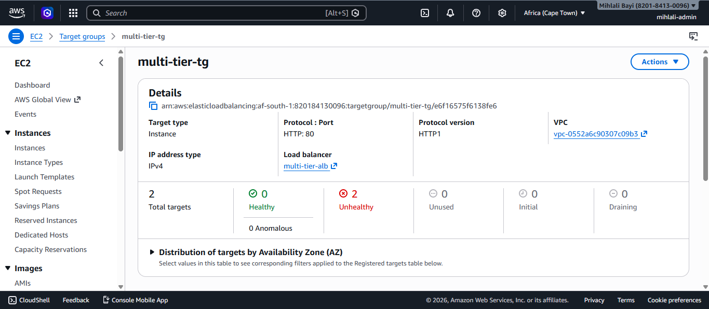
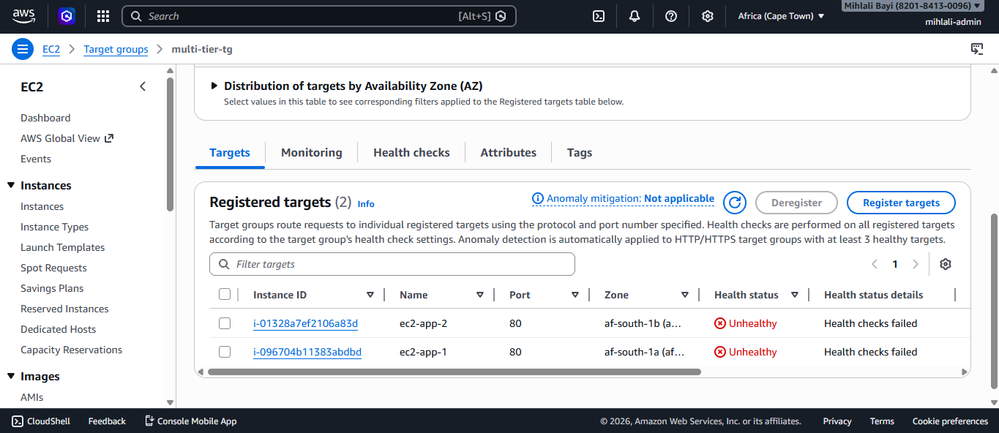
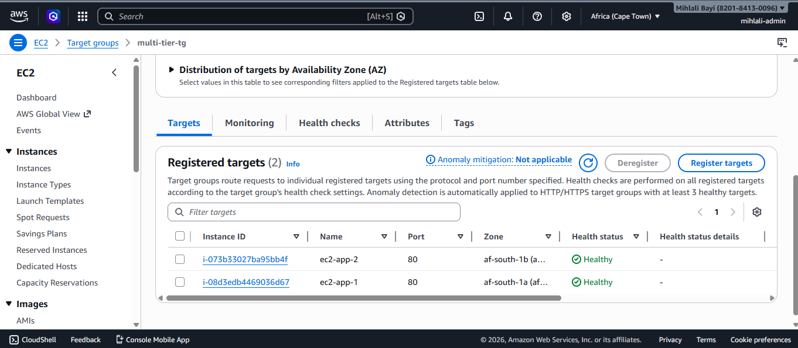

# Multi-Tier Cloud Architecture

I built this AWS project to understand how real production environments are structured. The three-tier pattern (load balancer in front, application servers in the middle, database in the back) comes up constantly in Solutions Architect material, and I wanted to actually build it instead of just reading about it.

## What this project demonstrates

- A custom VPC split across two availability zones for high availability
- Public and private subnets with separate route tables, separating internet-facing resources from internal ones
- An Application Load Balancer distributing traffic across two EC2 instances
- A bastion host as the controlled SSH entry point into the VPC
- An RDS MySQL database in private subnets, reachable only from the application layer
- Security group chaining so every layer only accepts traffic from the layer above it

## Architecture diagram

## How it works

A user request hits the Application Load Balancer in the public subnets over HTTP. The ALB forwards it to one of two EC2 instances running Apache. The instances connect to the RDS MySQL database in the private subnets. Security groups enforce the rules at every layer: the ALB accepts traffic from the internet, the EC2 instances only accept traffic from the ALB, and RDS only accepts traffic from the EC2 instances. The bastion host sits separately, accepting SSH only from my IP, and is the controlled entry point for any administrative access.

## Stack

- **Networking:** Amazon VPC, public and private subnets, Internet Gateway, route tables
- **Compute:** EC2 (t3.micro) running Apache on Amazon Linux 2023
- **Load balancing:** Application Load Balancer with health checks
- **Database:** RDS MySQL (db.t3.micro), Single-AZ
- **Security:** Security groups chained between layers, bastion host for SSH
- **Region:** Africa (Cape Town), `af-south-1`

## Design journey

The most interesting part of this project wasn't the final build, it was getting there. I want to document the full story because the trade-offs are more valuable than the end state.

### Original design: EC2 in private subnets

I originally placed both EC2 instances in private subnets, which is the textbook three-tier pattern. The bastion host was in a public subnet so I could SSH through it into the private EC2s. The User Data script on each EC2 ran `yum install -y httpd` at launch to set up Apache.

After launching, the ALB target group showed both instances as **Unhealthy**:

### The NAT Gateway problem

The reason was straightforward once I worked it out. Private subnets have no route to the internet by default. The User Data script tried to install Apache from yum repositories, but the EC2 instances had no way to reach those repositories. Apache never installed, so port 80 was never listening, so the ALB health checks failed.

The standard production fix is a NAT Gateway. It sits in a public subnet and gives private resources a one-way path to the internet for outbound traffic like package downloads, while still blocking inbound traffic. A NAT Gateway costs roughly $32 per month and is not part of the AWS Free Tier.

### My decision: trade architecture purity for cost

I made a deliberate trade-off. Instead of paying for a NAT Gateway, I redeployed the EC2 instances into the public subnets. This is not the production-recommended pattern, but it let me test the full request path end-to-end while staying within Free Tier.

After moving the EC2s to public subnets and re-registering them with the target group, both instances showed **Healthy**:

I kept the bastion host in the build. With EC2 in public subnets it is technically redundant, since I could SSH straight to the EC2 public IPs. I left it as documentation of the original security pattern. In production with private EC2s, the bastion would be necessary.

### What I would do in production

In a real production environment I would keep EC2 in private subnets and add a NAT Gateway for outbound traffic. The hourly cost is justified once the workload has any real traffic, and the security posture is significantly better.

## Verifying it works

The app itself is a small landing page set up by the User Data script (see [`app/user-data.sh`](app/user-data.sh)). It just prints the EC2 instance's hostname using bash's `$(hostname)` substitution. The whole point is that when you refresh the page through the ALB DNS, the hostname changes, proving that the ALB is actually load-balancing between the two instances:

The top half shows `ip-10-0-2-100` (ec2-app-2 in af-south-1b), the bottom shows `ip-10-0-1-163` (ec2-app-1 in af-south-1a). Same URL, different backends, on consecutive refreshes.

## Security group chaining

This was the most valuable part of the project to get right. Each security group only allows the minimum traffic needed, and they reference each other instead of IP ranges, which means the rules adapt automatically when instances change IPs.

- **alb-sg:** allows HTTP (80) and HTTPS (443) from anywhere ([screenshot](screenshots/06_sg-alb.png))
- **ec2-sg:** allows HTTP (80) only from `alb-sg` ([screenshot](screenshots/07_sg-ec2.png))
- **rds-sg:** allows MySQL (3306) only from `ec2-sg` ([screenshot](screenshots/09_sg-rds.png))
- **bastion-sg:** allows SSH (22) only from my IP address ([screenshot](screenshots/08_sg-bastion.png))

The result is a chain where each layer only trusts the layer above it. Even if someone got an EC2's internal IP, they couldn't reach the database directly. Even if someone got to the database's endpoint, they couldn't connect without coming from an EC2 in the right security group.

## Setup walkthrough

The full build is captured in the [`screenshots/`](screenshots/) folder, numbered in build order: VPC, subnets, Internet Gateway, route table, security groups, EC2 instances, ALB, target group states, RDS, and the browser test.

## What I learned

- Security group chaining clicks differently when you build it yourself versus reading about it. Referencing security groups by ID instead of by IP range is what makes the chain hold together as instances come and go.
- Private subnets aren't useful by themselves. They need either a NAT Gateway, a NAT instance, or VPC endpoints to actually function. "Private" is not a security feature alone, it's a network configuration that requires supporting infrastructure.
- Health check failures look like a bug, but often they're a symptom of a missing piece elsewhere. The ALB wasn't broken, the EC2s weren't broken, the security groups weren't broken. The instances just couldn't install software because the subnet had no internet route. Tracing back from the symptom to the actual cause is half the skill.
- Cost-driven design is real engineering. Choosing public subnets to skip a $32 service is the kind of decision that gets made in real teams every day.

## Cost

This project runs within the AWS Free Tier. Total monthly cost: $0. The instances are stopped when not in use to preserve Free Tier hours.

## What I would improve

- Add a NAT Gateway and move EC2 back into private subnets (the production-correct pattern)
- Replace the bastion host with AWS Systems Manager Session Manager. SSH-based bastions are an older pattern. Session Manager removes the need for port 22 to be open at all, uses IAM for access control, and logs every session for auditing.
- Add an Auto Scaling group so the number of EC2 instances adjusts with traffic
- Add HTTPS on the ALB using an ACM certificate, and redirect HTTP to HTTPS
- Enable RDS Multi-AZ for database high availability
- Replace manual console clicks with CloudFormation or Terraform so the whole stack can be rebuilt from code