# Multi-Tier Cloud Architecture

## What this project is

I built this to understand how real AWS systems are structured. 
Most production applications follow this pattern and it comes up 
constantly in Solutions Architect material, so I wanted to actually 
build it rather than just read about it.

## Architecture diagram

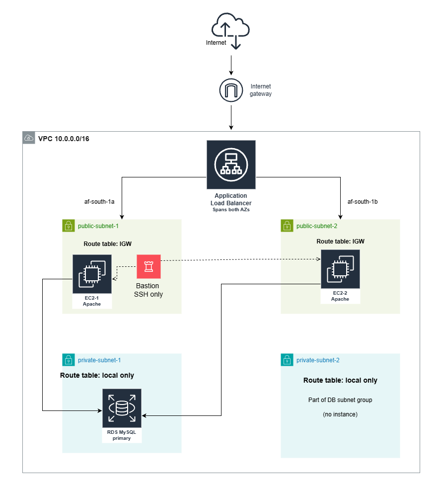

## How it works

Traffic comes in from the internet and hits the Application Load 
Balancer first. The ALB then forwards that traffic to one of two 
EC2 instances running Apache. Those instances connect to a MySQL 
database managed by RDS. Security groups control exactly what can 
talk to what at every layer.

## The setup in screenshots

VPC created with public and private subnets across two availability zones:

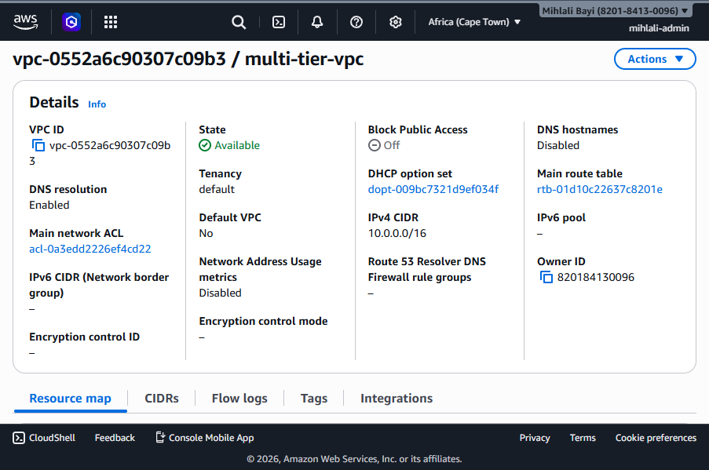

Four subnets configured, two public and two private:

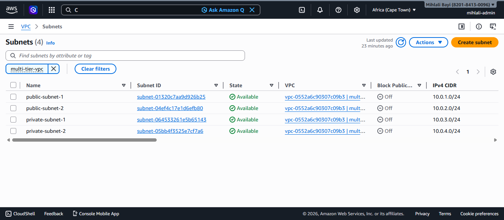

Internet Gateway attached to the VPC:

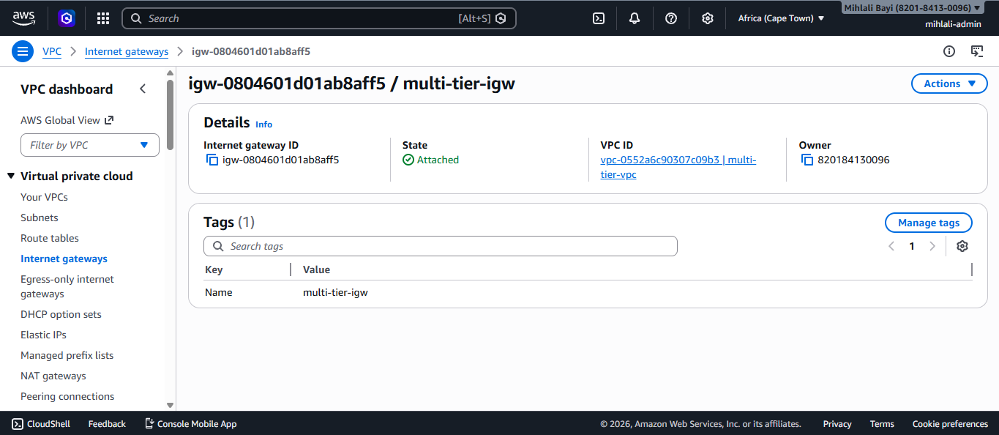

Route table with IGW route associated to the public subnets:

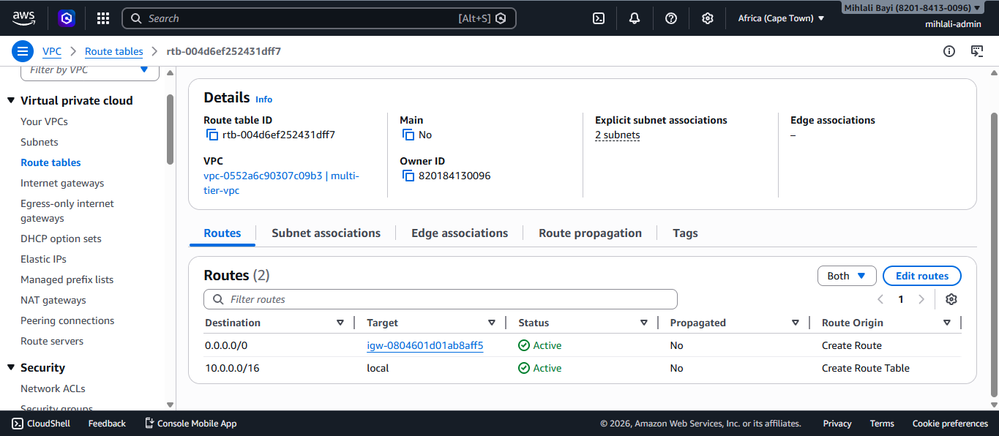

Security groups configured with least-privilege rules between layers:

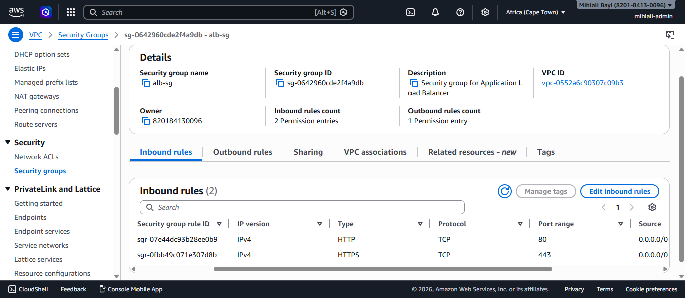
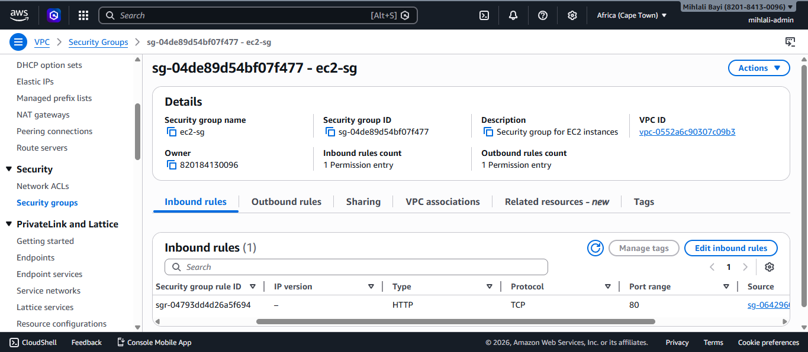
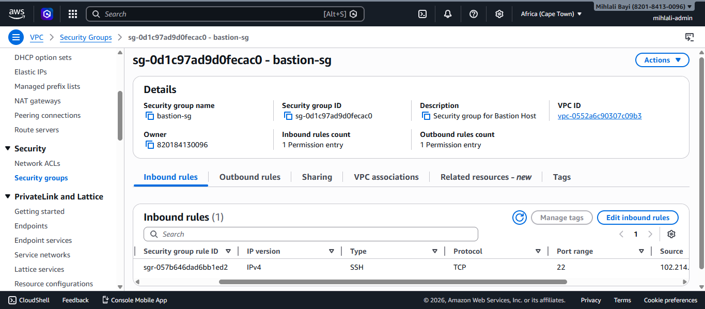
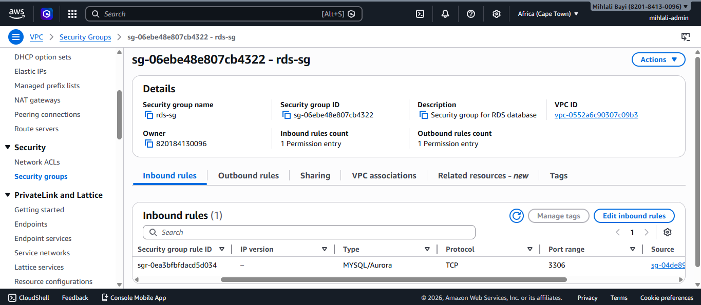

All three EC2 instances running:

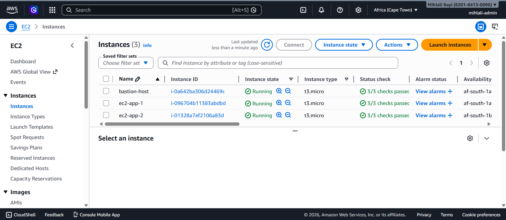

Load balancer active and both targets healthy:

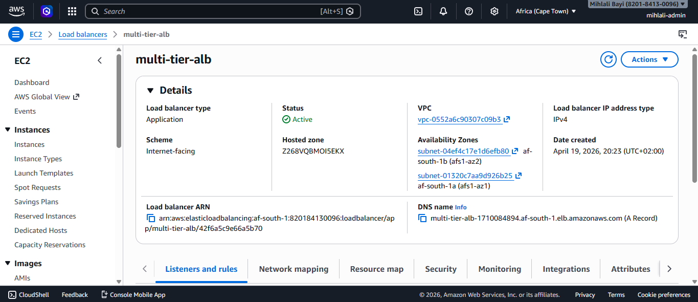
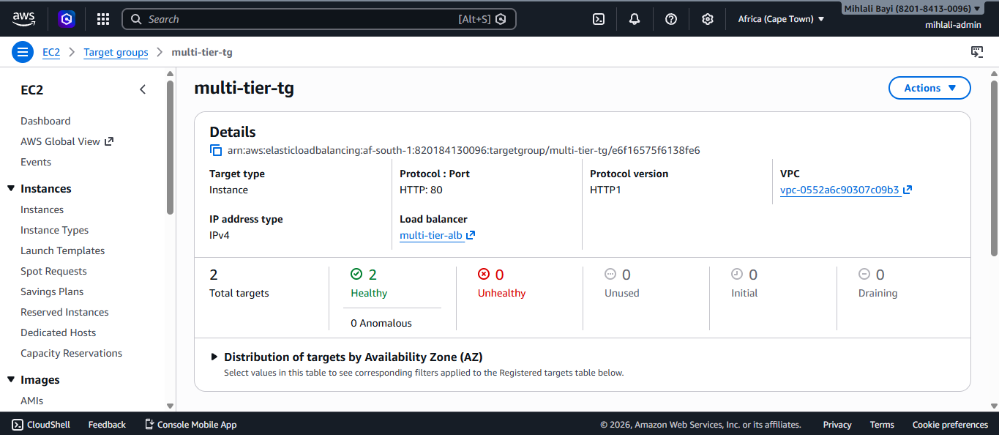

RDS database available:

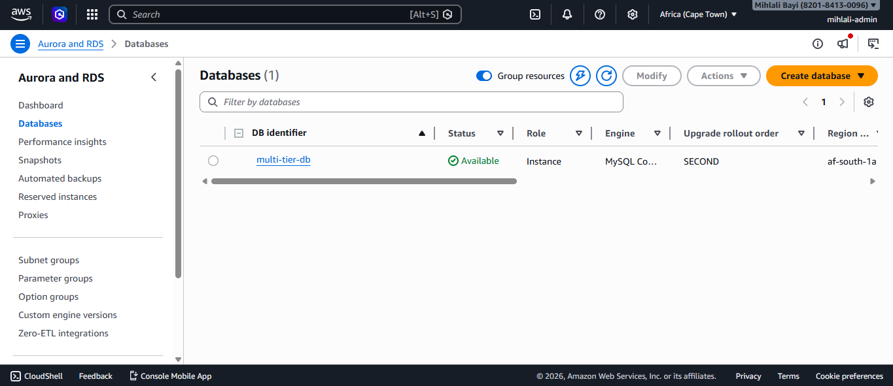

The app loading through the ALB DNS, switching between both 
EC2 instances on refresh which confirms load balancing is working:

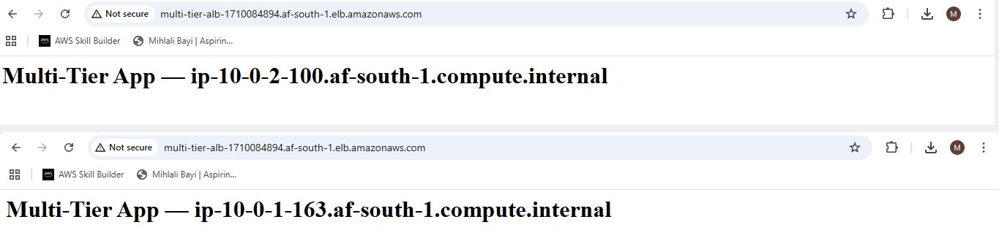

## Services used

Amazon VPC, EC2 t3.micro, Application Load Balancer, 
RDS MySQL db.t3.micro, Security Groups, Internet Gateway

## What I learned

The security group chaining was the most valuable thing to 
understand hands on. The ALB only accepts public traffic, EC2 
only accepts traffic from the ALB, and RDS only accepts traffic 
from EC2. Setting that up yourself makes it click in a way that 
reading about it does not.

## Note on the setup

EC2 instances are in public subnets because private subnets 
need a NAT Gateway to install packages and that has an hourly 
cost. In production I would keep them private with a NAT Gateway.

## Cost

Everything runs within the AWS Free Tier. Total cost: $0.

#### For a full breakdown of every decision I made during the build, 
see the [VPC Setup Notes](infrastructure/vpc-setup-notes.md).

## What I would improve

Add Auto Scaling, HTTPS on the ALB using ACM, move EC2 into 
private subnets with a NAT Gateway, and add RDS Multi-AZ for 
high availability.